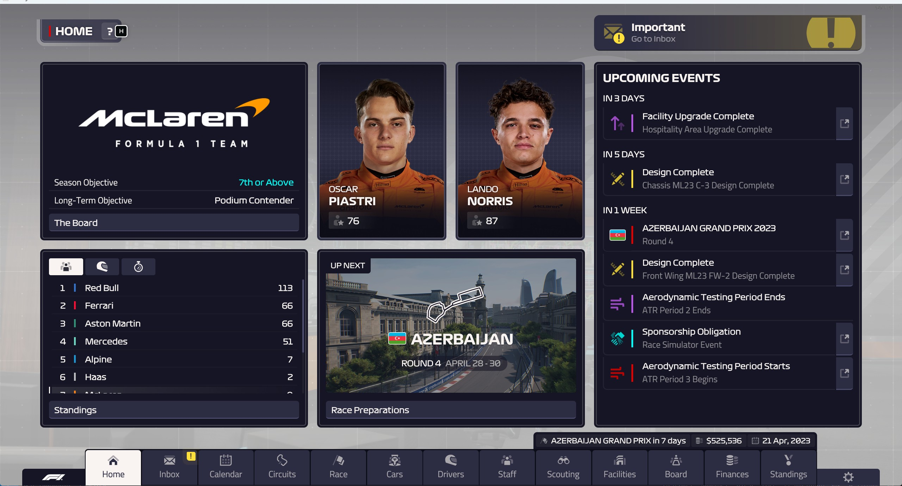
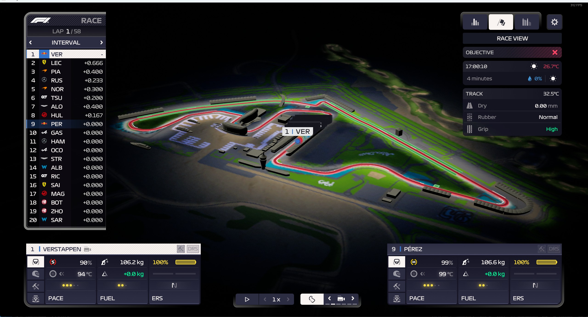
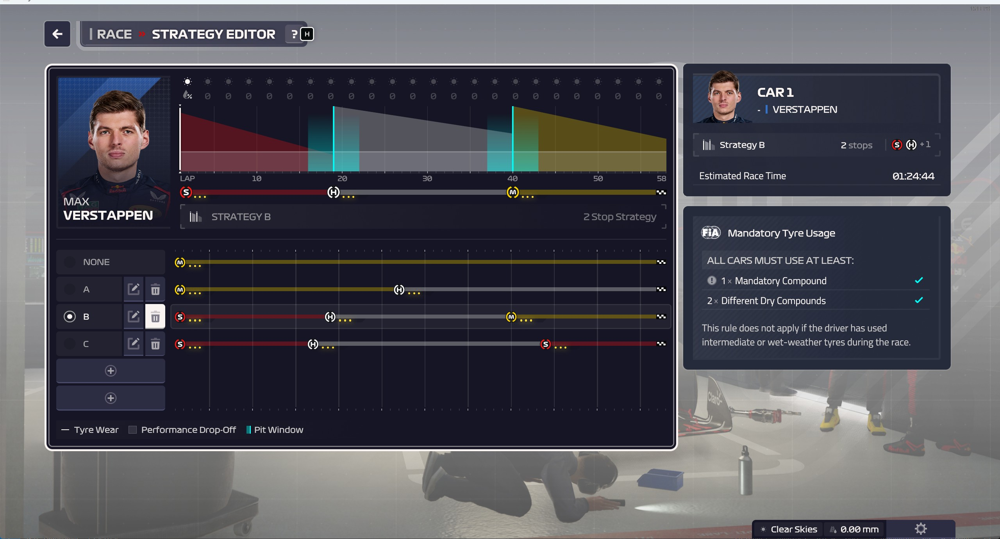

## F1 赛车 + 多 agent 交互的 unity 实现

### 问题说明

1. 社会行为复杂性：人类社会行为涉及多个智能体的协作、沟通和决策，如何准确模拟这些行为并体现其复杂性是一个挑战；

   - 通过模拟 F1 大奖赛的整个比赛周的赛前-赛中-赛后的全流程、模拟不同角色的扮演，展示多 agent 之间的协作关系和交互过程

2. 可视化展示效果：如何将模拟过程和结果以直观、清晰的方式展示出来，使用户能够方便地查看任务进度、Agent 行为和整体任务完成情况；

   - 通过 unity 实现对应的 ui 设计、展示 agent 的活动和行为（ui 面板设计可参考类似游戏中的现有界面风格、无需从头设计）

3. 交互方式设计：如何设计合理的交互方式，使用户能够方便地设计任务、搭建虚拟场景、管理知识库与 Agent 成员、追踪任务进度并进行数据统计。

   - 交互方式：在赛前-赛中-赛后的任意一个阶段、可以通过 ui 面板中、修改输入框中的提示词进行任务的设计、
   - 需要用 unity 进行对应场景的搭建
   - 需要一个额外的 ui 面板去实现 Agent 的管理、任务进度的追踪和数据统计（先前游戏中未实现过）

### 用户期望

面向科研、教育和娱乐等领域，我们希望选手能够基于文心大模型和 Unity 的能力，面向某一特定主题，小到晚会举办、开办公司，大到城市管理、行业，打造出一个能够模拟人类社会合作行为、具备过程可视化和结果可靠输出的多 Agent 社会行为模拟系统。

- 项目目的：

  - 这个 F1 项目的核心目的是通过模拟 F1 大奖赛的整个比赛周期，包括赛前准备、比赛过程和赛后总结，来展现一个高度复杂且协作紧密的赛事生态。通过多 Agent 系统，我们可以模拟车队、车手、工程师、策略师、媒体团队等多个角色的行为，观察他们如何在不同的情境下做出决策、相互配合，并应对比赛中的各种突发状况。比如，赛前如何制定策略，赛中如何根据天气、轮胎磨损等因素调整战术，赛后如何总结经验教训并为下一场比赛做准备。

  - 这样的模拟不仅能让观众更直观地了解 F1 比赛背后复杂的运作机制，还能揭示团队合作、决策制定和资源分配的重要性。对于科研和教育领域，这种模拟可以帮助研究人类社会协作行为的规律；对于娱乐领域，它可以提供一种沉浸式的体验，让观众像“亲临现场”一样感受比赛的紧张和刺激。总的来说，这个项目既有趣味性，也有实用价值，能够以通俗易懂的方式展示 F1 赛事的魅力与复杂性。

### 技术要求

1. 模型使用要求：使用文心大模型进行 Agent 的开发，Agent 具备分析、理解、决策和交流等能力；

   - 分析：

     - **轮胎磨损分析**：根据实时数据预测轮胎的磨损程度，判断是否需要进站换胎。
     - **天气影响分析**：结合天气预报，分析雨天的赛道湿滑程度，制定相应的驾驶策略。
     - **竞争对手策略分析**：通过观察其他车队的进站时间和圈速，推测他们的战术意图。

   - 理解：

     - **规则理解**：理解 F1 赛事的安全车规则，判断何时可以超车或减速。
     - **赛道状况理解**：根据赛道的弯道、直道和抓地力情况，选择最佳的行驶路线。
     - **车手意图理解**：通过车手的驾驶行为，推测其是否在试探对手或保存轮胎。

   - 决策（Agent 需要根据分析和理解的结果做出快速决策）：

     - **进站时机决策**：根据轮胎磨损和比赛进程，决定是否在某一圈进站换胎。
     - **战术调整决策**：在比赛中发现对手速度过快时，决定是否改变原有的燃油策略或轮胎策略。
     - **风险控制决策**：在赛道出现事故时，判断是否减速或改变路线以确保安全。

   - 交流（Agent 需要与其他 Agent 进行高效沟通）：

     - **车手与工程师交流**：车手向工程师反馈车辆状况（如引擎动力不足或轮胎抓地力下降），工程师则提供调整建议。
     - **策略师与车队交流**：策略师向车队负责人汇报比赛形势，提出战术调整建议。
     - **媒体与公众交流**：媒体 Agent 根据比赛结果生成新闻报道或社交媒体内容，向公众传达比赛亮点和关键信息。

2. 场景搭建要求：使用 Unity 进行虚拟场景的搭建，包括场地布局、建筑物、设备等元素，以模拟真实世界中的环境；

   - 初步设想：根据以下图片作为参考基础进行构建、先构建一个二维上的赛道、然后在赛道上添加车辆、然后添加对应的 agent 进行协作

3. 协作关系建模：选取针对性的场景主题，构建不同 Agent 之间的协作关系和交互过程，包括策划、沟通、冲突解决、成果输出、反思等尽可能全面的流程；

   - 场景主题：F1 大奖赛的整个比赛周期，包括赛前准备、比赛过程和赛后总结
   - 重点关注：协作关系和交互过程
   - 策划：进站策略、升级策略、超车策略等
   - 沟通：车手与工程师、车队内部人员、媒体与车手等
   - 冲突解决：车手与工程师意见不一致、车队内部策略冲突、不同车队之间的竞争等
   - 成果输出：比赛结果、车队排名、车手表现、车队内部评价等
   - 反思：赛后的车队内的总结、比如领队、工程师、策略师、车手等共同开会复盘策略、总结经验

4. 可视化展示：设计直观、清晰的可视化界面，展示 Agent 的活动过程和结果，以及虚拟场景的状态和整体任务完成情况；

   - 该界面尚未有具体的设计，可以参考游戏中的 ui 风格进行设计
   - 具体展示方法（待讨论）（单独一个界面，或弹窗）
   - 以下这些内容放在一个界面中显示
     - 活动过程和结果：比如车手当前的驾驶行为、机械工程师的部件调整建议、赛道策略师的战术调整、媒体的报道内容等等
     - 虚拟场景的状态：比如赛道的湿度、温度、各个车手的位置、车辆的状态等等
     - 整体任务完成情况：比如比赛到了第几圈、赛季中车手的排名、车队的排名等等
   - 可以有一个任务图、每个任务都显示需要若干个 agent 进行协调、每个 agent 的能力会不太一样

5. 交互方式设计：提供便捷的交互方式，使用户能够设计任务、微调场景、追踪与查看进度、检索信息、检查成果和进行数据统计与复盘；

   - 具体展示方法（待讨论）（单独一个界面，或弹窗）
   - 以下这些内容放在另一个界面中显示
     - 设计任务
     - 微调场景（模拟上帝：自定义何时下雨 撞车？）
     - 追踪与查看进度
     - 检索信息
     - 检查成果
     - 数据统计与复盘

6. 任务监管：实现对 Agent 行为的监管，确保模拟的社会行为符合社会主流价值观；

   - 在推理前加入对应的提示词、比如“避免撞车策略”、“保持安全距离”等（否则可能会出现一些不符合社会主流价值观的行为，伤害了其他 agent 的安全、比如让车手故意撞车引发安全车、带来有利的策略等等）

   1. **避免危险驾驶**

   - **提示词**：“安全驾驶，避免危险行为。”
   - **例子**：防止车手 Agent 故意制造碰撞以引发安全车，从而获得战术优势。通过提示词约束，Agent 会优先考虑安全驾驶，而不是采取极端策略。

   2. **尊重比赛规则**

   - **提示词**：“遵守赛道规则，尊重其他车手。”
   - **例子**：防止车手 Agent 在黄旗或安全车情况下超车，或者故意阻挡其他车手的正常行驶。通过提示词约束，Agent 会严格按照赛事规则行事。

   3. **保护车手安全**

   - **提示词**：“优先考虑车手安全，避免高风险操作。”
   - **例子**：防止工程师 Agent 在车辆出现故障时仍然要求车手继续比赛，或者策略师 Agent 在极端天气下要求车手冒险加速。通过提示词约束，Agent 会优先确保车手的安全。

7. 部署要求：系统应能够部署在云端或本地上，优先能够在云端允许多用户同时访问和使用；

   - 优先云端？
   - 多用户同时访问的策略：每个用户运行一个实例副本？避免了多用户同时访问同一个实例界面的并发问题？或者若多用户同时登录、逻辑应该如何（感觉在我们的用例下应该化繁为简，选择前者）

8. 附加功能：获取真实世界信息，如地理位置、天气系统、实时股票、公开资料等辅助 Agent 世界的建构。选手也可发挥想象力，通过摄像头、麦克风等输入，通过飞桨深度学习感知模型，把真实世界的特征加入 Agent 协作过程，增强人机交互丰富性。

   - 真实世界信息：通过共享赛道条件的天气信息、温度、湿度、不仅显示在界面上、同样影响对应的赛中决策和（unity 的实际显示场景变化可选）
   - 感知模型增强人机交互：通过麦克风输入、语音识别、语音合成等方式，增强人机交互的丰富性。（比如可以通过语音输入来进行任务设计，或者发布会上通过语音合成、将 agent 的决策结果进行展示，比如车手的语音通过对应训练的语音进行输出，为次要需求）

### 提交材料

1. 项目概要介绍;（文档）

2. 项目简介 PPT;（文档，重点）

3. 项目详细方案;（文档）

4. 项目演示视频;（视频）

5. 企业要求提交的材料：

   ① 产品使用手册：包括产品功能架构、使用流程图和典型学习示例；（文档，需要流程图和例子）

   ② 产品交互演示：对产品的交互过程进行录制、Agent 如上线请附上链接；（视频）

   ③ 项目的详细分工及过程文档：对团队成员的角色、分工、排期和过程进行记录。（文档）

6. 团队自愿提交的其他补充材料。

### 任务清单

包括但不限于以下功能：

1. 集成文心大模型，确保 Agent 具备所需能力；（必有）

2. 使用 Unity 构建特定的虚拟场景；（必有）

3. 设计 Agent 间的协作关系和角色职责；（通过 F1 的比赛周全流程和不同角色的扮演显示）

4. 开发直观的可视化界面展示 Agent 活动和场景状态；（注意在 unity ui 设计中、如何展示在 F1 大奖赛比赛周的每个阶段、通过可视化界面展示 agent 的活动和行为）

5. 打造满足上文技术要求的交互方式；（必有，通过输入文本、点击界面等方式进行交互，有额外时间可以利用麦克风等设备作为输入、然后也是转为文字后进行处理）

6. 本地或云端部署；（可实现 unity 游戏本地运行、多 agent 服务可以在云端部署计算）

7. 利用感知模型增强人机交互，探索 AR/VR 等创新方式（有时间、可以做语音输入）；

8. 打通真实世界与虚拟场景，增强人机交互丰富性（通过共享赛道条件的天气信息、温度、湿度、不仅显示在界面上、同样影响对应的赛中决策和（场景变化可选））。

### 具体 agent 的设计和相关参数

以下 agent 的相关参数在类似游戏中可参考

1. 车手（参与比赛、反馈自身驾驶状况）

2. 领队（车队负责人，负责制定赛季整体战略以及车队发展规划，有最终决策权）

3. 赛道工程师（即策略师，负责制定比赛战术，包括轮胎策略、燃油策略、ers 策略等）

4. 机械工程师（进行赛车装配，也负责换轮胎）

5. 技术总监（负责车辆的机械设计和升级）

6. 空气动力学主管（负责车辆的空气动力学设计和优化）

7. 数据分析师（根据赛道和车辆的数据，提供战术建议）

8. 体育总监（负责车队的整体运营，包括车手的培训、车队人员的招聘、训练和管理等）

9. 媒体人员（记者，负责采访车手和领队，报道比赛结果和车队动态）

10. 赛道工作人员

    - 赛事总监（即裁判，负责监督比赛过程，对赛道上的违规行为进行处罚）
    - 医疗人员（驾驶医疗车，负责赛道上的紧急救援）
    - 安全车驾驶员（负责在安全车出动时，赛道上引导赛车，确保赛道安全）
    - 马修（负责赛道的维护和清理赛道上的碎片）

### 具体的实例及相关参数（非 agent）

非 agent，不参与决策，但作为数据支撑，需要参与到任务流中

相关参数在类似游戏中可参考

1. 赛车

   - 轮胎
   - 赛车的各种部件

2. 赛道（每条赛道有推荐的最佳赛车性能）

### 流程拆分

拆分成固定任务流和自定义任务流，每个任务流中包含赛前、赛中、赛后的任务

#### 固定任务流

预设的任务流、即在用户不输入的情况下、多 agent 会根据既定的任务流和数据进行协作，完整地模拟 F1 大奖赛的整个比赛周期，包括赛前准备、比赛过程和赛后总结。体现协作关系。

- 过程中需要能够查看对应的进度情况和数据分析

### **赛前**

1. **赛前发布会**

   - **媒体人员 Agent**：组织发布会，采访车手和领队，报道车队的赛季目标和比赛策略。
   - **车手 Agent**：回答记者提问，表达对比赛的期待和信心。
   - **领队 Agent**：公布车队的赛季整体战略和比赛目标。

2. **赛车升级与调校**

   - **技术总监 Agent**：根据赛道特性，提出赛车的机械升级方案。
   - **空气动力学主管 Agent**：优化赛车的空气动力学设计，提升赛道表现。
   - **机械工程师 Agent**：根据车手反馈和赛道数据，进行车辆调校和装配。
   - **车手 Agent**：参与练习赛，测试车辆性能并提供反馈。

3. **策略制定**
   - **赛道工程师 Agent**：分析赛道特性、天气预报和历史数据，预设进站策略、轮胎策略和燃油策略。
   - **数据分析师 Agent**：提供赛道数据和对手分析，辅助策略制定。

---

### **赛中**

1. **比赛实时协作**

   - **车手 Agent**：根据比赛情况反馈赛车状态（如轮胎磨损、燃油消耗、车辆稳定性等），并与策略师实时沟通调整战术。
   - **赛道工程师 Agent**：监控比赛数据，实时调整进站策略和战术指令。
   - **领队 Agent**：协调车队整体行动，调整车手心态，处理突发状况。
   - **机械工程师 Agent**：在进站时快速更换轮胎，进行车辆维修和调整。

2. **赛道安全与维护**

   - **赛事总监 Agent**：监督比赛过程，对违规行为进行处罚。
   - **安全车驾驶员 Agent**：在事故或恶劣天气时驾驶安全车，引导赛车减速。
   - **医疗人员 Agent**：在发生事故时进行紧急救援。
   - **马修 Agent**：清理赛道上的碎片，确保赛道安全。

3. **媒体实时报道**
   - **媒体人员 Agent**：捕捉比赛亮点，发布实时更新，采访车手和领队。

---

### **赛后**

1. **赛后发布会**

   - **媒体人员 Agent**：组织赛后发布会，采访车手和领队，报道比赛结果和车队表现。
   - **车手 Agent**：总结比赛表现，分享比赛感受。
   - **领队 Agent**：评价车队表现，公布未来改进计划。

2. **数据总结与分析**

   - **数据分析师 Agent**：整理比赛数据，分析车手表现、车辆性能和战术效果。
   - **赛道工程师 Agent**：复盘比赛策略，提出优化建议。
   - **技术总监 Agent**和**空气动力学主管 Agent**：根据比赛数据，制定车辆性能改进方案。

3. **车手与工程师讨论**
   - **车手 Agent**：与机械工程师 Agent 讨论车辆调校和性能改进建议。
   - **机械工程师 Agent**：根据车手反馈，调整车辆配置和调校方案。

---

### **进度与数据分析的可视化**

- 在模拟过程中，用户可以实时查看以下内容：
  - **比赛进度**：当前圈数、车手排名、进站次数等。
  - **车辆状态**：轮胎磨损、燃油消耗、车辆稳定性等。
  - **战术执行**：进站策略、轮胎策略、燃油策略的执行情况。
  - **数据分析**：车手表现、车辆性能、战术效果的详细分析。

#### 自定义任务流（用户输入）

自定义的任务流、即用户可以根据自己的需求、输入对应的任务流、然后多 agent 会根据用户输入的任务流和数据进行协作，完成对应的任务。体现协作关系。

- 过程中需要能够查看对应的进度情况和数据分析

---

### **赛前**

1. **用户输入**：要求车队在赛前进行一次特殊的车辆升级，重点提升直道速度。

   - **技术总监 Agent**：制定直道速度提升的机械升级方案。
   - **空气动力学主管 Agent**：优化车辆的空气动力学设计，减少直道阻力。
   - **机械工程师 Agent**：完成车辆装配和调校。
   - **车手 Agent**：参与测试，提供反馈。

2. **用户输入**：要求车手在赛前发布会上透露部分战术信息，以迷惑对手。

   - **车手 Agent**：在发布会上透露虚假的战术信息（如“我们将采用一停策略”）。
   - **媒体人员 Agent**：报道车手的发言，制造舆论效果。
   - **领队 Agent**：评估对手可能的反应，调整实际战术。

3. **用户输入**：要求在练习赛中模拟极端天气条件下的驾驶策略。
   - **赛道工程师 Agent**：制定雨天或高温条件下的驾驶策略。
   - **车手 Agent**：在模拟条件下测试车辆性能。
   - **数据分析师 Agent**：收集数据，分析极端天气对车辆和战术的影响。

---

### **赛中**

1. **用户输入**：要求车手在比赛中故意放慢速度，以观察对手的反应。

   - **车手 Agent**：在比赛中适度减速，观察对手的战术变化。
   - **赛道工程师 Agent**：分析对手的反应，调整后续战术。
   - **领队 Agent**：评估是否继续执行该策略。

2. **用户输入**：要求在比赛中提前进站，尝试“undercut”战术。

   - **赛道工程师 Agent**：提前计算进站窗口，制定 undercut 战术。
   - **机械工程师 Agent**：在进站时快速更换轮胎。
   - **车手 Agent**：在出站后全力推进，争取超越对手。

3. **用户输入**：要求在安全车出动时，让车手进站更换轮胎。
   - **赛道工程师 Agent**：判断安全车出动时机，决定进站策略。
   - **车手 Agent**：在安全车引导下进站更换轮胎。
   - **机械工程师 Agent**：完成快速换胎。

---

### **赛后**

1. **用户输入**：要求赛后发布会聚焦于车辆性能问题，为车队争取更多研发资源。

   - **车手 Agent**：在发布会上强调车辆性能不足，呼吁研发团队改进。
   - **领队 Agent**：向媒体传达车队需要更多资源的信号。
   - **媒体人员 Agent**：报道车手和领队的发言，制造舆论压力。

2. **用户输入**：要求赛后数据分析重点关注竞争对手的战术漏洞，为下一场比赛做准备。

   - **数据分析师 Agent**：分析竞争对手的战术执行情况，找出漏洞。
   - **赛道工程师 Agent**：制定针对竞争对手漏洞的战术方案。
   - **技术总监 Agent**：根据对手的弱点，提出车辆升级建议。

3. **用户输入**：要求车手与工程师团队进行一次深度讨论，优化车辆调校方案。
   - **车手 Agent**：详细反馈比赛中的车辆表现，提出改进建议。
   - **机械工程师 Agent**：根据反馈调整车辆调校。
   - **技术总监 Agent**：评估是否需要长期改进方案。

---

### **进度与数据分析的可视化**

- 在自定义任务流执行过程中，用户可以实时查看以下内容：
  - **任务执行进度**：当前任务的完成情况（如车辆升级进度、战术执行情况）。
  - **实时数据分析**：任务执行中的数据反馈（如车辆性能提升效果、战术成功与否）。
  - **Agent 协作状态**：各 Agent 在执行任务中的具体行为和决策。

### 难点

1. 赛道互动的具体实现，比如赛车的行驶、如何利用每个既定参数进行合适的模拟（需讨论）

   - 比如：怎么模拟超车，撞车，进站，爆胎，驶出赛道，天气变化等等（需要讨论）
   - 感觉可以探索有没有现有类似项目可以借鉴（比如在赛车游戏的参数如何模拟，或者类似多 agent 的协作关系的具体实现项目）

2. Agent 之间的协作关系和交互过程的设计，如何让多个 Agent 之间能够有效地协作、沟通和决策

   - 感觉可以通过预设的提示词、根据真实世界中的现实人设、给每个 agent 加上对应的提示词、然后根据提示词进行决策
   - 具体工作流也可以根据代码能够实现的粒度进行调整

3. 要是模拟每一条赛道和比赛的话，工作量大，且无法全部演示

   - 可以先在 1 条赛道上做细致的模拟（比如弯道、数据、特性等）、其余的画饼即可，能够跑通赛前-赛中-赛后的流程即可
   - 赛前可以利用预设的先前的赛后反思总结的数据，模拟成数据分析的闭环即可（也避免了模拟多场比赛可能导致类似结果的问题）（也来证明这个分析反思结果是有效的）

## 项目具体细节

### 项目分工

1. ui 设计（1 人）：

   - 可视化界面展示 Agent 活动和场景状态
   - 交互方式设计
   - 可基于游戏界面给出对应风格的 ui 设计
   - 需要界面：

2. unity 界面搭建+逻辑编写（2-3 人）：

   - 场地布局、建筑物、设备等元素（具体实现？）
   - 模拟真实世界中的环境
   - 接入多 agent 的协作关系并实现对应的交互过程
   - 需要实现用例：（待梳理）

3. 文档编写（人数不限，共同阅读）

   - 项目概要介绍
   - 项目简介 PPT
   - 项目详细方案
   - 产品使用手册
   - 项目的详细分工及过程文档

4. 云端运维（1 人）

   - 部署 unity 实例在云端，实现多用户同时访问

5. 项目演示视频（1 人，结束时制作）

   - 项目演示视频
   - 产品交互演示视频

6. 进度管理

   - 时间不多，需要平台看板？（https://www.teambition.com/organization/661cd783c765f59335c06c83/my）

### 时间节点安排

1. 3 月 12 日 - 3 月 18 日：

   - 完成项目概要介绍
   - 完成项目详细方案
   - 开始 ui 界面设计
   - unity 环境搭建，ui 素材收集，开始搭建 ui 界面
   - unity 学习接入 llm 多 agent demo
   - 服务器设施准备：完成云端部署 unity demo 实例并实现多用户同时访问
   - 完成实例数据的迁移和准备（搜集或制表，思路可以是去网上找把这个游戏里的对应数据的表格拉下来、然后再作为可以参照的数据）

2. 3 月 19 日 - 3 月 25 日：

   - 完成 ui 界面设计
   - 完成项目 ppt
   - unity 完成项目 ui 界面的搭建，完成 2 个核心用例逻辑的编写
   -

3. 3 月 26 日 - 4 月 1 日：

   - 完成产品使用手册（核心功能和最终演示流程）
   - unity 开始接入多 agent 的协作关系并实现对应的交互过程，并实现更多用例
   -

4. 4 月 2 日 - 4 月 8 日：

   - unity 基本完成所有既定要求功能的实现（附加功能，接入现实数据等）
   - 完成项目的详细分工及过程文档
   -

5. 4 月 9 日 - 4 月 15 日：

   - 部署项目实例到云端、并实现多用户同时访问的各种简易测试
   - 根据实际内容，完善项目 ppt
   - 完成项目演示视频
   - 完成产品交互演示视频
